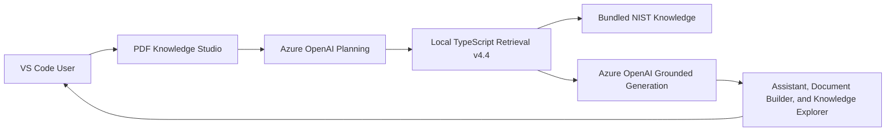
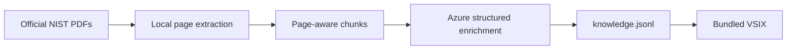

# PDF Knowledge Studio

[](./CHANGELOG.md)
[](https://code.visualstudio.com/)
[](https://www.typescriptlang.org/)
[](./LICENSE)
[](https://github.com/RakeshSw)

**A self-contained AI knowledge platform for Visual Studio Code.**

PDF Knowledge Studio turns curated document knowledge into three connected products:

- **Grounded Assistant** — source-backed answers with citations.
- **Document Builder** — evidence-backed documents with Markdown and Mermaid visuals.
- **Knowledge Explorer** — an interactive concept map with guided learning and knowledge checks.

> **Ask. Explore. Understand. Create.**

## Why it is different

- Retrieval runs locally in the VS Code extension.
- The knowledge pack is bundled with the VSIX.
- Users do not need Python, Node.js, Docker, FastAPI, a vector database, or a retrieval server.
- Azure OpenAI is used for planning and grounded generation.
- The API key is stored through VS Code SecretStorage.

## Architecture


## Download and install

Download the latest packaged extension from the
[GitHub Releases page](https://github.com/RakeshSw/PDFKnowledgeStudioGitHub/releases/download/v0.4.1/pdf-knowledge-assistant-0.4.1.vsix).

Then install it in Visual Studio Code:

1. Open **Extensions**.
2. Select the `...` menu.
3. Choose **Install from VSIX...**
4. Select the downloaded `.vsix` file.
5. Reload Visual Studio Code.
## Products

### Grounded Assistant

```text
@pdf-knowledge What are the six NIST CSF 2.0 Functions?
```

Includes Fast and Deep modes, follow-up rewriting, compound-question planning, citations, page ranges, suggested questions, and handoff to the other products.


### Document Builder

```text
Create a beginner-friendly implementation guide for NIST CSF 2.0 Organizational Profiles.
```


Includes document planning, per-section retrieval, rendered preview, raw Markdown, Mermaid visuals, and source evidence.

### Knowledge Explorer

Includes an overall concept map, clickable knowledge nodes, guided learning, related concepts, suggested questions, knowledge checks, and document handoff.


## Quick start

### Requirements for VSIX users

- Visual Studio Code
- Your Azure OpenAI endpoint, deployment name, API version, and API key

### Installation

1. Download the VSIX from GitHub Releases.
2. In VS Code run **Extensions: Install from VSIX**.
3. Reload VS Code.
4. Run **PDF Knowledge: Configure Azure OpenAI**.
5. Enter your Azure OpenAI endpoint, deployment name, API version, and API key.
6. Run **PDF Knowledge: Test Local Knowledge and Azure OpenAI**.

### Example prompts

```text
@pdf-knowledge What are the six NIST CSF 2.0 Functions?

@pdf-knowledge /deep Explain how Current and Target Profiles support cybersecurity improvement.

@pdf-knowledge Compare CSF Tiers and Organizational Profiles.

@pdf-knowledge /explore NIST Cybersecurity Framework 2.0
```

## Local retrieval

The local precision-first pipeline includes normalization, query expansion, BM25-style ranking, weighted-field scoring, intent boosts, mismatch penalties, relevance thresholds, diverse evidence selection, and balanced context packing.

See [docs/local-retrieval.md](./docs/local-retrieval.md).

## Knowledge pack

This repository snapshot contains a **55-record public NIST demonstration pack**. A larger generated pack can be inserted with:

```powershell
.\scripts\replace-knowledge-pack.ps1 `
  -KnowledgeFile "C:\path\to\knowledge.jsonl"
```

The script validates the JSONL and updates the manifest count and SHA256.


## Technical documentation

Start here:

- **[End-to-end build, test, and publication guide](./docs/end-to-end-guide.md)**

Reference guides:

- [Architecture](./docs/architecture.md)
- [Official source documents and download links](./docs/source-documents.md)
- [How the knowledge file is manufactured](./docs/knowledge-manufacturing.md)
- [How local retrieval works](./docs/local-retrieval.md)
- [Installation and configuration](./docs/installation.md)
- [Knowledge-pack replacement](./docs/knowledge-pack.md)

### Knowledge manufacturing at a glance



### Retrieval at a glance


## Security model

- API keys are never committed.
- The API key is stored using VS Code SecretStorage.
- Retrieval and ranking remain local.
- Only the user question, selected evidence, and generation instructions are sent to Azure OpenAI.
- The bundled content is public NIST cybersecurity material.

See [SECURITY.md](./SECURITY.md).

## Build from source

Development requires VS Code, Node.js 20+, npm, and PowerShell.

```powershell
.\scripts\build-vsix.ps1 `
  -TargetRoot ".\extension" `
  -OutputFolder ".\artifacts"
```

## Repository structure

```text
extension/          VS Code source, compiled runtime, prompts, and bundled knowledge
knowledge-pipeline/ Python build-time PDF extraction and enrichment pipeline
docs/               Architecture, manufacturing, retrieval, and installation guides
scripts/            Build, scanning, and knowledge-pack utilities
```

## Current release

**v0.4.1**

- Grounded Assistant
- Document Builder
- Knowledge Explorer
- Local TypeScript Retrieval v4.4
- Public NIST demonstration pack
- Azure rate-limit retry and backoff
- No runtime Python or retrieval service

## Limitations

- Azure OpenAI connectivity is required for generated content.
- The knowledge pack is fixed at build time.
- This is a technical proof of concept, not a production cybersecurity advisory service.
- The current release targets desktop VS Code.

## Roadmap

- Pluggable knowledge packs
- Knowledge-pack updater
- User-selected document collections
- Automated retrieval benchmarks
- Configurable model providers
- VS Code Marketplace publication

## License

MIT. Public NIST content and third-party libraries remain subject to their original terms.

<!-- creator-and-publisher:start -->
## Creator and publisher

**PDF Knowledge Studio** is designed and developed by **[Rakesh Swain](https://github.com/RakeshSw)**.

Rakesh is an engineering leader focused on practical enterprise AI, grounded knowledge systems, local retrieval, developer tooling, document intelligence, and AI-assisted delivery.

- **Creator and maintainer:** [Rakesh Swain](https://github.com/RakeshSw)
- **GitHub profile:** [https://github.com/RakeshSw](https://github.com/RakeshSw)
- **Source repository:** [https://github.com/RakeshSw/PDFKnowledgeStudioGitHub](https://github.com/RakeshSw/PDFKnowledgeStudioGitHub)
- **Issues and feature requests:** [https://github.com/RakeshSw/PDFKnowledgeStudioGitHub/issues](https://github.com/RakeshSw/PDFKnowledgeStudioGitHub/issues)
- **License:** [MIT](./LICENSE)

The project is an independently developed proof of concept demonstrating how curated document knowledge can be transformed into a self-contained AI experience inside Visual Studio Code.
<!-- creator-and-publisher:end -->

<!-- one-command-build:start -->
## One-command build and local installation

After the prerequisites and Azure OpenAI settings are configured, the complete workflow can be executed with one command:

```powershell
Set-ExecutionPolicy -Scope Process Bypass

.\scripts\run-all.ps1
```

The command automatically:

1. Verifies Git, Node.js, npm, Python, and the repository structure.
2. Creates or reuses the Python virtual environment.
3. Validates the Azure OpenAI `.env` configuration without printing the API key.
4. Downloads the official NIST PDFs and verifies their SHA256 hashes.
5. Extracts PDF text and creates page-aware chunks.
6. Reuses existing Azure-enriched chunks, or enriches new and changed chunks.
7. Merges the enriched documents into `knowledge.jsonl`.
8. Validates record count, source metadata, duplicate IDs, placeholders, and source-document coverage.
9. Installs the generated knowledge pack into the extension.
10. Validates the extension knowledge manifest and SHA256.
11. Reuses existing npm dependencies when they are available.
12. Runs the publication scan.
13. Compiles the TypeScript extension.
14. Packages the VSIX.
15. Installs the VSIX locally.

Expected ending:

```text
SUCCESS: complete PDF Knowledge Studio build and test passed.
```

### Required local prerequisites

Install these once:

- Visual Studio Code
- Git for Windows
- Node.js 20 or newer with npm
- Python 3.11 or newer; Python 3.12 is the tested version
- PowerShell 5.1 or newer

### Required Azure OpenAI configuration

Before the first run:

1. Create or use an Azure OpenAI resource.
2. Deploy a supported chat model.
3. Record the resource endpoint.
4. Record the deployment name.
5. Copy an API key from the resource's **Keys and Endpoint** page.
6. Create:

   ```text
   knowledge-pipeline/.env
   ```

7. Configure:

   ```text
   AZURE_OPENAI_ENDPOINT=https://YOUR-RESOURCE.openai.azure.com
   AZURE_OPENAI_API_KEY=YOUR-KEY
   AZURE_OPENAI_DEPLOYMENT=YOUR-DEPLOYMENT-NAME
   AZURE_OPENAI_MODE=legacy
   AZURE_OPENAI_API_VERSION=2024-10-21
   ```

The deployment name is the Azure deployment identifier, not necessarily the underlying model name.

Never commit `.env` or the API key.

### Common one-shot variations

Normal repeat run:

```powershell
.\scripts\run-all.ps1
```

Force all Azure enrichment again after a source, prompt, model, or chunking change:

```powershell
.\scripts\run-all.ps1 -ForceEnrichment
```

Refresh Python and npm dependencies:

```powershell
.\scripts\run-all.ps1 -RefreshDependencies
```

Build the VSIX without installing it:

```powershell
.\scripts\run-all.ps1 -SkipVsixInstall
```

The built VSIX is written to:

```text
artifacts/
```

### Scope of the command

The one-shot workflow builds, validates, packages, and optionally installs the extension locally.

It does not:

- create the Azure subscription or Azure OpenAI resource
- deploy the Azure model
- create the API key
- publish to the Visual Studio Marketplace
- publish a GitHub release

Those remain explicit administrative or release-management steps.
<!-- one-command-build:end -->
