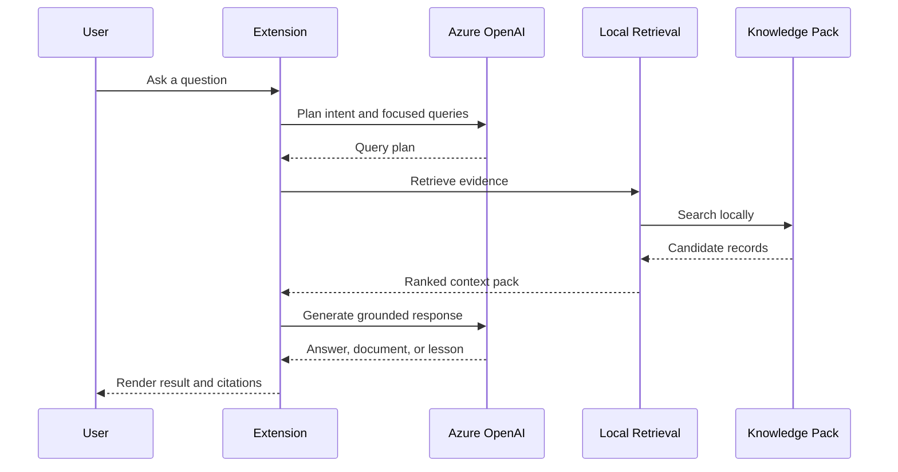

# Architecture

PDF Knowledge Studio is a desktop VS Code extension with local retrieval and a bundled knowledge pack.

## Components

- VS Code chat participant and commands
- Document Builder webview
- Knowledge Explorer webview
- Azure OpenAI client
- Local TypeScript retrieval
- Bundled NIST knowledge
- Markdown and Mermaid renderers

## Data boundary

The full knowledge pack, scores, and ranking decisions remain local. The question, selected evidence excerpts, and generation instructions are sent to Azure OpenAI.
