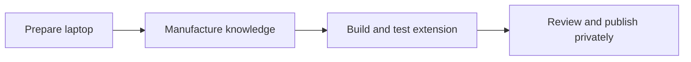

# End-to-End Build, Test, and Publication Guide

This is the primary step-by-step guide for rebuilding and testing PDF Knowledge Studio from a clean Windows laptop.

The process has four major phases:



## Phase A — Prepare the laptop

### Step 1 — Install prerequisites

Install:

- Visual Studio Code
- Git for Windows
- Node.js 20 or newer
- Python 3.12
- PowerShell 5.1 or newer

Verify in a new PowerShell terminal:

```powershell
git --version
node --version
npm.cmd --version
py --version
code --version
```

At least Python 3.11 is required. The tested setup uses Python 3.12.

When Python is missing, install it for the current user:

```powershell
winget install `
  --id Python.Python.3.12 `
  --exact `
  --scope user `
  --accept-package-agreements `
  --accept-source-agreements
```

Close and reopen VS Code after installation.

### Step 2 — Open the repository

```powershell
cd "C:\Projects\PDFKnowledgeStudioGitHub"
code .
```

The repository root should contain:

```text
extension/
knowledge-pipeline/
docs/
scripts/
README.md
```

### Step 3 — Allow the local PowerShell scripts for this terminal

```powershell
Set-ExecutionPolicy -Scope Process Bypass
```

This changes the policy only for the current PowerShell process.

---

## Phase B — Manufacture the knowledge pack

### Step 4 — Enter the pipeline folder

```powershell
cd ".\knowledge-pipeline"
```

### Step 5 — Create the Python virtual environment

```powershell
py -3.12 -m venv .venv
```

Verify:

```powershell
Test-Path ".\.venv\Scripts\python.exe"
```

Expected:

```text
True
```

### Step 6 — Install Python dependencies

```powershell
.\.venv\Scripts\python.exe -m pip install --upgrade pip

.\.venv\Scripts\python.exe -m pip install -r requirements.txt
```

Verify:

```powershell
.\.venv\Scripts\python.exe -c "import pypdf, openai, dotenv; print('Pipeline dependencies ready')"
```

Expected:

```text
Pipeline dependencies ready
```

### Step 7 — Download and verify the official PDFs

```powershell
.\download_source_pdfs.ps1
```

The script:

1. Downloads 12 official NIST publications.
2. Stores them under:

   ```text
   KnowledgeSource/NIST_CSF_2_0_Knowledge_Base/pdfs
   ```

3. Verifies each file against its pinned SHA256.
4. Reuses matching files on later runs.
5. Stops when a downloaded file no longer matches the pinned source manifest.

Review the catalogue:

```text
docs/source-documents.md
knowledge-pipeline/source_manifest.csv
```

### Step 8 — Configure Azure OpenAI

Create a local `.env`:

```powershell
Copy-Item ".\.env.example" ".\.env" -Force
notepad ".\.env"
```

Set:

```text
AZURE_OPENAI_ENDPOINT=https://YOUR-RESOURCE.openai.azure.com
AZURE_OPENAI_API_KEY=YOUR-KEY
AZURE_OPENAI_DEPLOYMENT=YOUR-DEPLOYMENT
AZURE_OPENAI_MODE=legacy
AZURE_OPENAI_API_VERSION=2024-10-21
```

Save and close Notepad.

Important:

- `.env` is ignored by Git.
- Never copy the real key into README files, scripts, screenshots, issues, or commits.

### Step 9 — Test local extraction without Azure

```powershell
.\run_01_pdf_enrichment.ps1 `
  -Limit 1 `
  -NoLlm
```

This verifies:

- Python works.
- A PDF can be opened.
- Embedded page text can be extracted.
- Text normalization works.
- Page-aware chunks are created.

This mode creates local placeholders. They are excluded from the production knowledge build by default.

### Step 10 — Test one real Azure enrichment

Create a one-document test folder using the small CSF Tiers publication:

```powershell
$sourcePdf = ".\KnowledgeSource\NIST_CSF_2_0_Knowledge_Base\pdfs\07_Using_the_CSF_Tiers.pdf"
$testSource = ".\KnowledgeSource\TestEnrichment"

New-Item -ItemType Directory -Force -Path $testSource | Out-Null

Copy-Item `
  -LiteralPath $sourcePdf `
  -Destination $testSource `
  -Force
```

Run the real enrichment:

```powershell
.\run_01_pdf_enrichment.ps1 `
  -Source ".\KnowledgeSource\TestEnrichment" `
  -Out ".\out-test-enrichment" `
  -Force
```

Do not add `-NoLlm`.

Expected summary:

```text
Processed documents : 1
Failed documents    : 0
Azure-enriched      : 1
```

### Step 11 — Inspect the single-document enrichment

```powershell
$documentFile = Get-ChildItem `
  ".\out-test-enrichment\03_enriched_chunks\by_document\*.jsonl" |
  Select-Object -First 1

$record = Get-Content $documentFile.FullName `
  -Encoding UTF8 |
  Select-Object -First 1 |
  ConvertFrom-Json
```

Check generation metadata:

```powershell
$record.generation | Format-List
```

Expected:

```text
mode           : azure-openai
provider       : Azure OpenAI
deployment     : your configured deployment
prompt_version : pdf-enrichment-v1
```

Review the generated knowledge:

```powershell
$record.knowledge |
  Select-Object `
    title,
    topic,
    document_purpose,
    summary,
    evidence_quality |
  Format-List
```

Review source grounding:

```powershell
$record.source |
  Select-Object file_name, page_start, page_end, pdf_sha256 |
  Format-List
```

Review the execution report:

```powershell
Get-Content `
  ".\out-test-enrichment\reports\pdf_enrichment_report.json" `
  -Raw |
  ConvertFrom-Json |
  Format-List
```

### Step 12 — Enrich all downloaded PDFs

```powershell
.\run_01_pdf_enrichment.ps1
```

Do not use `-Force` for a normal resume. The pipeline reuses completed chunk caches.

For the supplied 12-document source collection, the expected tested result is:

```text
Processed documents : 12
Failed documents    : 0
Created chunks      : 55
Azure-enriched      : 55
```

The exact count can change if the source documents or chunking configuration change.

### Step 13 — Build the final retriever-ready knowledge file

```powershell
.\run_02_build_knowledge.ps1
```

This stage is local and does not call Azure OpenAI.

It reads:

```text
out/03_enriched_chunks/by_document
```

and writes:

```text
out/04_knowledge_base/
├── knowledge.jsonl
├── document_catalog.jsonl
├── relationships.jsonl
├── generation_quality_report.json
└── knowledge_manifest.json
```

The wrapper intentionally uses `$InputFolder`, not `$Input`. `$Input` conflicts with PowerShell's automatic `$input` variable and can cause Python to receive `--input` without a path.

Direct Python fallback:

```powershell
& ".\.venv\Scripts\python.exe" `
  ".\02_build_knowledge_base.py" `
  --input ".\out\03_enriched_chunks\by_document" `
  --out ".\out\04_knowledge_base" `
  --config ".\config.json"
```

### Step 14 — Validate the generated knowledge

```powershell
$knowledgeFile = ".\out\04_knowledge_base\knowledge.jsonl"

$records = @(
  Get-Content $knowledgeFile -Encoding UTF8 |
    Where-Object { $_.Trim() } |
    ForEach-Object { $_ | ConvertFrom-Json }
)

Write-Host "Valid knowledge records:" $records.Count
```

Check source metadata:

```powershell
$missingSource = @(
  $records |
    Where-Object {
      -not $_.source.file_name -or
      $null -eq $_.source.page_start -or
      $null -eq $_.source.page_end
    }
)

Write-Host "Records missing source metadata:" $missingSource.Count
```

Expected:

```text
Records missing source metadata: 0
```

Check duplicate IDs:

```powershell
$duplicates = @(
  $records |
    Group-Object id |
    Where-Object Count -gt 1
)

Write-Host "Duplicate record IDs:" $duplicates.Count
```

Expected:

```text
Duplicate record IDs: 0
```

Check placeholders:

```powershell
$placeholderMatches = Select-String `
  -Path $knowledgeFile `
  -Pattern "local-placeholder|no-llm" `
  -CaseSensitive:$false

Write-Host "Placeholder matches:" @($placeholderMatches).Count
```

Expected:

```text
Placeholder matches: 0
```

Check document coverage:

```powershell
$records |
  Group-Object { $_.source.file_name } |
  Sort-Object Name |
  Select-Object Name, Count |
  Format-Table -AutoSize
```

Review the reports:

```powershell
Get-Content `
  ".\out\04_knowledge_base\generation_quality_report.json" `
  -Raw |
  ConvertFrom-Json |
  Format-List

Get-Content `
  ".\out\04_knowledge_base\knowledge_manifest.json" `
  -Raw |
  ConvertFrom-Json |
  Format-List
```

### Step 15 — Install the generated pack into the extension

Return to the repository root:

```powershell
cd ..
```

Run:

```powershell
.\scripts\replace-knowledge-pack.ps1 `
  -KnowledgeFile ".\knowledge-pipeline\out\04_knowledge_base\knowledge.jsonl"
```

The script:

1. Parses every non-empty JSONL line.
2. Rejects an empty or invalid file.
3. Copies the pack into:

   ```text
   extension/media/knowledge/knowledge.jsonl
   ```

4. Updates:

   ```text
   extension/media/knowledge/manifest.json
   ```

5. Writes the record count and SHA256.

Confirm the installed pack:

```powershell
$extensionKnowledge = ".\extension\media\knowledge\knowledge.jsonl"
$extensionManifest = Get-Content `
  ".\extension\media\knowledge\manifest.json" `
  -Raw |
  ConvertFrom-Json

$installedCount = @(
  Get-Content $extensionKnowledge |
    Where-Object { $_.Trim() }
).Count

Write-Host "JSONL records :" $installedCount
Write-Host "Manifest count:" $extensionManifest.recordCount
```

The two counts must match.

---

## Phase C — Build and test the VS Code extension

### Step 16 — Run the complete repository test

From the repository root:

```powershell
.\scripts\test-repository.ps1
```

The test performs:

1. Publication/private-reference scan.
2. JSONL parse validation.
3. Manifest count validation.
4. Knowledge SHA256 validation.
5. `npm.cmd install`.
6. TypeScript compilation.
7. VSIX packaging.

Expected final message:

```text
SUCCESS: repository validation completed.
```

On later runs, after dependencies are already installed:

```powershell
.\scripts\test-repository.ps1 -SkipNpmInstall
```

### Step 17 — Locate the built VSIX

```powershell
Get-ChildItem ".\artifacts\*.vsix" |
  Select-Object Name, Length, LastWriteTime
```

### Step 18 — Install the freshly built VSIX

```powershell
$vsix = Get-ChildItem ".\artifacts\*.vsix" |
  Sort-Object LastWriteTime -Descending |
  Select-Object -First 1

code --install-extension $vsix.FullName --force
```

Reload VS Code:

```text
Ctrl + Shift + P
Developer: Reload Window
```

### Step 19 — Configure and test the extension

Run:

```text
PDF Knowledge: Configure Azure OpenAI
```

Enter your Azure OpenAI endpoint, deployment name, API version, and API key.

Then run:

```text
PDF Knowledge: Test Local Knowledge and Azure OpenAI
```

The reported local record count must match the installed manifest.

### Step 20 — Test the Grounded Assistant

Use:

```text
@pdf-knowledge What are the six NIST CSF 2.0 Functions?
```

```text
@pdf-knowledge /deep Explain how Current and Target Profiles are created and used.
```

```text
@pdf-knowledge Compare Organizational Profiles, Community Profiles, and CSF Tiers.
```

Validate:

- filenames and page ranges are cited
- answers are grounded in the supplied evidence
- direct questions do not include unrelated specialized sources
- Deep mode uses broader evidence
- suggested follow-up questions appear

### Step 21 — Test Document Builder

Run:

```text
PDF Knowledge: Open Document Builder
```

Generate:

```text
Create an implementation guide explaining how an organization can create a Current Profile, define a Target Profile, identify gaps, and prioritize actions.
```

Validate:

- plan generation
- section generation
- citations
- Markdown preview
- Mermaid rendering
- no empty sections
- no unrelated evidence

### Step 22 — Test Knowledge Explorer

Run:

```text
PDF Knowledge: Open Knowledge Explorer
```

Explore:

```text
NIST Cybersecurity Framework 2.0
```

Validate:

- concept map
- clickable nodes
- guided learning
- related concepts
- suggested questions
- knowledge checks
- Document Builder handoff

---

## Phase D — Review and private publication

### Step 23 — Run the final publication scan

```powershell
.\scripts\scan-publication.ps1
```

Expected:

```text
PASS: no configured private-reference patterns were found.
```

Search for possible credentials:

```powershell
Get-ChildItem . -Recurse -File |
  Where-Object {
    $_.FullName -notmatch "\\node_modules\\" -and
    $_.FullName -notmatch "\\.git\\" -and
    $_.FullName -notmatch "\\knowledge-pipeline\\.venv\\"
  } |
  Select-String `
    -Pattern "AZURE_OPENAI_API_KEY\s*=","api[_-]?key\s*[:=]" `
    -CaseSensitive:$false
```

Review every result. Placeholder values in `.env.example` are acceptable. A real key is not.

Confirm that ignored development outputs are not staged:

```powershell
git status --short
```

Do not check in:

- `.env`
- `.venv`
- downloaded PDFs
- pipeline output
- `node_modules`
- `artifacts`
- ZIP files
- VSIX files
- logs
- screenshots containing secrets or personal paths

### Step 24 — Initialize or verify Git

```powershell
git init
git branch -M main
```

Add the remote when it is not already configured:

```powershell
git remote add origin `
  "https://github.com/RakeshSw/PDFKnowledgeStudioGitHub.git"
```

Verify:

```powershell
git remote -v
```

### Step 25 — Stage and review

```powershell
git add .
git status
git diff --cached --stat
git diff --cached
```

Review the staged content before committing.

### Step 26 — Commit and push privately

```powershell
git commit -m "Initial release of PDF Knowledge Studio v0.4.1"

git push -u origin main
```

Keep the repository private until:

- README diagrams render correctly
- source links work
- no secret or private path is visible
- the extension compiles from a clean checkout
- the built VSIX passes all three product tests

### Step 27 — Create the GitHub release

After private review:

1. Create tag `v0.4.1`.
2. Create release title `PDF Knowledge Studio v0.4.1`.
3. Use `RELEASE_NOTES_v0.4.1.md`.
4. Attach the tested VSIX as a release asset.
5. Do not commit the VSIX to the main branch.
6. Add reviewed product screenshots.
7. Change repository visibility only after the final review.

---

## Rerun behavior

### Resume enrichment

```powershell
cd ".\knowledge-pipeline"
.\run_01_pdf_enrichment.ps1
```

Completed chunks are reused when source hashes and configuration have not changed.

### Force a complete enrichment rebuild

```powershell
.\run_01_pdf_enrichment.ps1 -Force
```

Use this only after an intentional prompt, model, source-document, or chunking change.

### Rebuild the final knowledge file only

```powershell
.\run_02_build_knowledge.ps1
```

This does not call Azure OpenAI.

### Rebuild the VSIX only

From the repository root:

```powershell
.\scripts\test-repository.ps1 -SkipNpmInstall
```

---

## Troubleshooting

### Python opens Microsoft Store

Use:

```powershell
py --version
```

Create the environment with:

```powershell
py -3.12 -m venv .venv
```

When necessary, disable the `python.exe` and `python3.exe` App Execution Aliases in Windows Settings.

### Stage-two builder says `--input: expected one argument`

Use the corrected:

```text
knowledge-pipeline/run_02_build_knowledge.ps1
```

The parameter must be named `$InputFolder`, not `$Input`.

Temporary direct fallback:

```powershell
& ".\.venv\Scripts\python.exe" `
  ".\02_build_knowledge_base.py" `
  --input ".\out\03_enriched_chunks\by_document" `
  --out ".\out\04_knowledge_base" `
  --config ".\config.json"
```

### Azure 401

The key does not match the endpoint/deployment, or it was copied incorrectly.

### Azure 429

The deployment reached a temporary request or token quota. Wait for the retry window and resume the pipeline. Completed chunks are cached.

### Image-only PDF creates no text

The pipeline uses `pypdf`, not OCR. OCR the PDF separately before ingestion.

<!-- one-command-build:start -->
## One-command build and local installation

After the prerequisites and Azure OpenAI settings are configured, the complete workflow can be executed with one command:

```powershell
Set-ExecutionPolicy -Scope Process Bypass

.\scripts\run-all.ps1
```

The command automatically:

1. Verifies Git, Node.js, npm, Python, and the repository structure.
2. Creates or reuses the Python virtual environment.
3. Validates the Azure OpenAI `.env` configuration without printing the API key.
4. Downloads the official NIST PDFs and verifies their SHA256 hashes.
5. Extracts PDF text and creates page-aware chunks.
6. Reuses existing Azure-enriched chunks, or enriches new and changed chunks.
7. Merges the enriched documents into `knowledge.jsonl`.
8. Validates record count, source metadata, duplicate IDs, placeholders, and source-document coverage.
9. Installs the generated knowledge pack into the extension.
10. Validates the extension knowledge manifest and SHA256.
11. Reuses existing npm dependencies when they are available.
12. Runs the publication scan.
13. Compiles the TypeScript extension.
14. Packages the VSIX.
15. Installs the VSIX locally.

Expected ending:

```text
SUCCESS: complete PDF Knowledge Studio build and test passed.
```

### Required local prerequisites

Install these once:

- Visual Studio Code
- Git for Windows
- Node.js 20 or newer with npm
- Python 3.11 or newer; Python 3.12 is the tested version
- PowerShell 5.1 or newer

### Required Azure OpenAI configuration

Before the first run:

1. Create or use an Azure OpenAI resource.
2. Deploy a supported chat model.
3. Record the resource endpoint.
4. Record the deployment name.
5. Copy an API key from the resource's **Keys and Endpoint** page.
6. Create:

   ```text
   knowledge-pipeline/.env
   ```

7. Configure:

   ```text
   AZURE_OPENAI_ENDPOINT=https://YOUR-RESOURCE.openai.azure.com
   AZURE_OPENAI_API_KEY=YOUR-KEY
   AZURE_OPENAI_DEPLOYMENT=YOUR-DEPLOYMENT-NAME
   AZURE_OPENAI_MODE=legacy
   AZURE_OPENAI_API_VERSION=2024-10-21
   ```

The deployment name is the Azure deployment identifier, not necessarily the underlying model name.

Never commit `.env` or the API key.

### Common one-shot variations

Normal repeat run:

```powershell
.\scripts\run-all.ps1
```

Force all Azure enrichment again after a source, prompt, model, or chunking change:

```powershell
.\scripts\run-all.ps1 -ForceEnrichment
```

Refresh Python and npm dependencies:

```powershell
.\scripts\run-all.ps1 -RefreshDependencies
```

Build the VSIX without installing it:

```powershell
.\scripts\run-all.ps1 -SkipVsixInstall
```

The built VSIX is written to:

```text
artifacts/
```

### Scope of the command

The one-shot workflow builds, validates, packages, and optionally installs the extension locally.

It does not:

- create the Azure subscription or Azure OpenAI resource
- deploy the Azure model
- create the API key
- publish to the Visual Studio Marketplace
- publish a GitHub release

Those remain explicit administrative or release-management steps.
<!-- one-command-build:end -->
