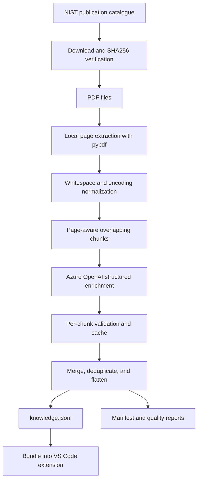
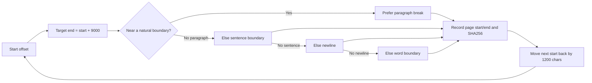

# How the Knowledge File Is Manufactured

This document explains how official PDF publications become the retriever-ready `knowledge.jsonl` bundled with PDF Knowledge Studio.

## End-to-end flow




## Rebuild sequence

For detailed prerequisite, inspection, testing, and publication instructions, follow the [end-to-end guide](./end-to-end-guide.md).

From the repository root:

```powershell
Set-ExecutionPolicy -Scope Process Bypass
cd ".\knowledge-pipeline"

py -3.12 -m venv .venv
.\.venv\Scripts\python.exe -m pip install --upgrade pip
.\.venv\Scripts\python.exe -m pip install -r requirements.txt

.\download_source_pdfs.ps1

Copy-Item ".\.env.example" ".\.env" -Force
notepad ".\.env"

.\run_01_pdf_enrichment.ps1 -Limit 1 -NoLlm
.\run_01_pdf_enrichment.ps1
.\run_02_build_knowledge.ps1

cd ..

.\scripts\replace-knowledge-pack.ps1 `
  -KnowledgeFile ".\knowledge-pipeline\out\04_knowledge_base\knowledge.jsonl"

.\scripts\test-repository.ps1
```

## Stage 0 — Pin the source collection

The source collection is defined in:

```text
knowledge-pipeline/source_manifest.csv
```

Each entry records:

- deterministic local filename
- official NIST download URL
- publication title and status
- page count
- pinned SHA256

The downloader validates the SHA256 so that the build is reproducible and a silent upstream document replacement is detected.

```powershell
.\\knowledge-pipeline\\download_source_pdfs.ps1
```

See [Official Source Documents](./source-documents.md).

## Stage 1 — Extract each PDF locally

Implemented by:

```text
knowledge-pipeline/01_pdf_to_enriched_chunks.py
```

The extractor recursively discovers `*.pdf` files and opens them with `pypdf.PdfReader`.

For every page it records:

```json
{
  "page_number": 4,
  "text": "Extracted source text...",
  "char_count": 3210,
  "extraction_error": ""
}
```

Behavior:

- If a PDF is encrypted, the pipeline attempts an empty-password open.
- Extraction failures are recorded per page rather than silently ignored.
- Null bytes and repeated whitespace are normalized.
- PDF metadata and the file SHA256 are preserved.
- Empty image-only PDFs produce no chunks and are reported as requiring OCR.

The PDF text extraction step is local. No PDF file is sent to Azure OpenAI.

## Stage 2 — Build page-aware overlapping chunks

Extracted pages are concatenated into a logical stream with explicit markers:

```text
[PAGE 1]
...

[PAGE 2]
...
```

Default settings:

```json
{
  "target_chars": 9000,
  "overlap_chars": 1200,
  "min_chars": 500
}
```

### Chunk boundary selection



The boundary search looks near the end of the target window and prefers:

1. paragraph break
2. sentence boundary
3. newline
4. whitespace

Each chunk records:

- chunk index
- source page start
- source page end
- original source text
- character count
- source-text SHA256

The overlap preserves context across chunk boundaries.

## Stage 3 — Enrich each chunk with Azure OpenAI

Only the current text excerpt and its metadata are sent to the configured Azure OpenAI deployment.

The system prompt requires a strict JSON object and says:

- use only the supplied excerpt
- do not add outside knowledge
- do not invent missing details
- use empty fields when evidence is missing
- keep answers compact and evidence-grounded

The enrichment schema includes:

- title, topic, and subtopics
- document purpose and summary
- atomic facts
- processes, actors, steps, and conditions
- requirements and controls
- roles and responsibilities
- systems and components
- standards references
- glossary and acronyms
- questions the chunk can answer
- concept relationships
- retrieval keywords
- evidence coverage and notes

### Reliability behavior

- JSON response mode is used when supported.
- The code falls back if the deployment does not support response format.
- Responses are parsed and validated as JSON objects.
- Failed requests retry with exponential backoff.
- Raw LLM responses are retained for diagnosis.
- Each completed chunk is cached independently.
- Unchanged PDFs and completed chunks are reused on rerun.

## Stage 4 — Build the final knowledge base

Implemented by:

```text
knowledge-pipeline/02_build_knowledge_base.py
```

The builder consumes only the enriched per-document JSONL files.

It:

1. Excludes `--no-llm` placeholders by default.
2. Deduplicates chunks using `document_id + source_text_sha256`.
3. Preserves the original source text.
4. Flattens enrichment fields into a searchable text representation.
5. Retains source filename, document ID, page range, and hashes.
6. Extracts and deduplicates concept relationships.
7. Produces document-level catalogue records.
8. Produces quality and coverage statistics.

Main output:

```text
knowledge-pipeline/out/04_knowledge_base/knowledge.jsonl
```

Additional outputs:

```text
document_catalog.jsonl
relationships.jsonl
generation_quality_report.json
knowledge_manifest.json
```

## Final record shape

A simplified final record looks like:

```json
{
  "record_type": "knowledge_chunk",
  "id": "document-chunk-id",
  "domain": "Cybersecurity",
  "subdomain": "Organizational Profiles",
  "title": "Creating and Using Organizational Profiles",
  "topic": "NIST CSF 2.0",
  "summary": "Evidence-grounded summary",
  "content": "Original PDF excerpt",
  "facts": [],
  "processes": [],
  "requirements": [],
  "controls": [],
  "roles": [],
  "questions_answered": [],
  "keywords": [],
  "retrieval": {
    "search_text": "Flattened searchable representation",
    "evidence_coverage": "high"
  },
  "source": {
    "file_name": "03_Creating_and_Using_Organizational_Profiles.pdf",
    "page_start": 3,
    "page_end": 5,
    "source_text_sha256": "..."
  },
  "lineage": {
    "enrichment_provider": "azure-openai",
    "deployment": "configured deployment",
    "prompt_version": "pdf-enrichment-v1"
  }
}
```

## Stage 5 — Install the generated pack into the extension

```powershell
.\\scripts\\replace-knowledge-pack.ps1 `
  -KnowledgeFile ".\\knowledge-pipeline\\out\\04_knowledge_base\\knowledge.jsonl"
```

This utility:

- validates every non-empty JSONL line
- rejects an empty file
- copies the file into `extension/media/knowledge`
- updates the manifest record count
- updates the SHA256

Build the VSIX:

```powershell
.\\scripts\\build-vsix.ps1
```

## Quality gates before release

1. Every JSONL line parses.
2. Record IDs and source hashes are present.
3. Source filenames and page ranges are retained.
4. Placeholder records are excluded.
5. Duplicate chunks are reported.
6. The knowledge manifest count matches the file.
7. The publication scan finds no private names or credentials.
8. The TypeScript extension compiles.
9. The VSIX contains the knowledge and manifest.
10. Retrieval benchmark questions return the expected sources.

## Reproducibility and limitations

- The pinned hashes reproduce the exact source pack used by this project.
- Azure enrichment can vary slightly between runs even with the same source excerpts.
- A model or prompt-version change should be treated as a new knowledge version.
- `pypdf` does not OCR image-only pages.
- Generated enrichment is supporting metadata; the original PDF excerpt remains the authoritative evidence.
