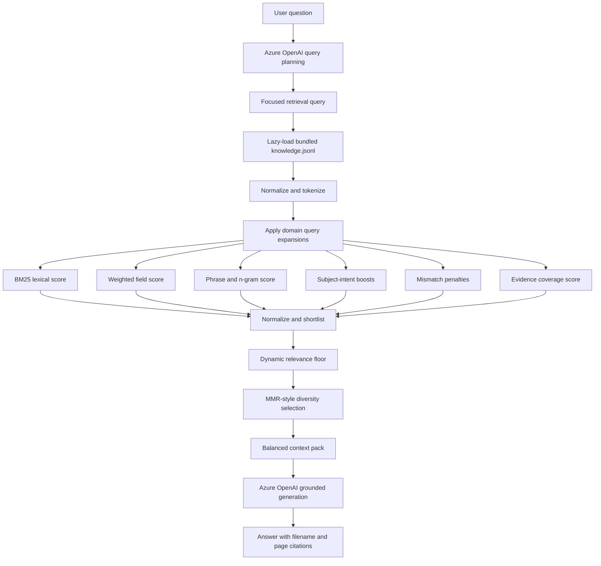

# How Local Retrieval Works

PDF Knowledge Studio does not call a Python retrieval service and does not require a vector database. Retrieval executes inside the VS Code extension using the bundled JSONL knowledge pack.

Implementation:

```text
extension/src/retrievalClient.ts
```

## End-to-end query flow



Azure OpenAI helps plan the focused query and generate the final response. The actual evidence search, scoring, filtering, and context packing are local.

## 1. Lazy knowledge loading

On the first retrieval request, the extension reads:

```text
media/knowledge/knowledge.jsonl
```

Every JSONL line is parsed and indexed in memory. The extension calculates:

- token counts per record
- unique-token sets
- corpus document frequency
- average record length
- field-specific token sets

The index is reused for the lifetime of the extension-host session.

The knowledge version includes the number of loaded records and a SHA256 prefix of the bundled file.

## 2. Query classification

The question is classified locally as one of:

- `direct`
- `process`
- `document`
- `general`

Examples:

- “What are the six Functions?” → direct
- “How do I create a Target Profile?” → process
- “Create an implementation guide” → document

The kind controls relevance thresholds, per-document limits, result counts, and context size.

## 3. Query normalization and expansion

The engine:

- lowercases and tokenizes terms
- removes general stopwords
- removes document-task words from document-generation queries
- preserves meaningful domain tokens
- adds curated domain expansions

Example:

```text
"CSF Tiers"
```

expands with terms such as:

```text
tier, partial, risk-informed, repeatable, adaptive
```

These expansions improve recall without requiring embeddings.

## 4. Candidate scoring

### BM25

The lexical score uses:

```text
k1 = 1.35
b  = 0.72
```

Document frequency and average record length are calculated from the bundled pack.

### Weighted field score

Query-token overlap is weighted by field:

| Field | Weight |
|---|---:|
| Title | 4.4 |
| Topic and subtopics | 3.6 |
| Keywords | 3.2 |
| Questions answered | 2.8 |
| Systems/components | 2.0 |
| Full unique-token set | 0.9 |

### Phrase score

Additional points are added for:

- full query in the record text
- full query in title
- full query in topic
- matching 2-, 3-, and 4-token sequences

### Intent boosts and mismatch penalties

The engine detects subjects such as:

- CSF Functions
- Organizational Profiles
- Community Profiles
- Tiers
- Informative References
- Incident Response
- Supply Chain
- Ransomware
- Enterprise Risk Management
- Workforce
- Small Business

Directly relevant publications receive explicit boosts. Tangential specialized publications receive penalties when the query does not concern them.

### Combined raw score

The actual combination is:

```text
0.38 × BM25
+ 0.25 × weighted field score
+ 0.10 × phrase score
+ 0.25 × subject-intent score
+ 0.02 × evidence-coverage score
− 0.32 × mismatch penalty
```

Records with no meaningful overlap and no positive intent signal are discarded before reranking.

## 5. Shortlisting and dynamic relevance floors

Candidate limits:

| Mode | Candidate pool | Shortlist | Context budget |
|---|---:|---:|---:|
| Fast | 60 | 30 | 50,000 characters |
| Deep | 150 | 60 | 90,000 characters |

Relevance policy:

| Query kind | Normalized floor | Minimum retained | Per-document limit |
|---|---:|---:|---:|
| Direct | 0.50 | 4 | 3 |
| Process | 0.38 | 6 | 4 |
| General | 0.32 | 6 | 4 |
| Document | 0.20 | 12 | 5 |

The first minimum number can survive below the floor, preventing an overly aggressive threshold from returning too little evidence.

## 6. MMR-style diversity selection

The shortlist is selected with a relevance-versus-redundancy calculation.

For direct questions:

```text
0.96 × relevance − 0.04 × redundancy
```

For process questions:

```text
0.94 × relevance − 0.06 × redundancy
```

For general and document questions:

```text
0.92 × relevance − 0.08 × redundancy
```

Redundancy considers:

- Jaccard-like token similarity
- same-document similarity
- overlapping page ranges

This avoids returning many nearly identical excerpts from the same document.

## 7. Adaptive final result counts

| Query kind | Fast | Deep |
|---|---:|---:|
| Direct | 6 | 8 |
| Process | 10 | 12 |
| General | 8 | 10 |
| Document | 14 | 22 |

A caller can override the final count, capped at 30.

## 8. Balanced context packing

Selected records are converted into a context pack containing:

- evidence number
- source filename
- page or page range
- record ID
- relevance
- title
- topic
- summary
- original evidence content

The remaining context budget is divided across the remaining records so one long excerpt cannot consume the entire prompt. Oversized content is truncated with an explicit marker.

The pack instructs the generator to:

- answer only from supplied evidence
- cite filename and page range
- mark unsupported information as missing

## 9. Why local lexical retrieval was selected

For this POC, the bundled knowledge pack is compact and terminology-rich. Local lexical retrieval provides:

- no retrieval server
- no authentication dependency
- no Python runtime for users
- no vector database
- deterministic and inspectable ranking
- fast startup after lazy loading
- offline evidence search

The architecture can later add embeddings or pluggable knowledge packs, but neither is required for the current release.

## 10. Observability

Every retrieval response includes timings for:

- knowledge loading
- candidate scoring
- reranking
- context packing
- total retrieval

Debug output includes:

- detected query kind
- detected subjects
- expanded query tokens
- eligible candidate count
- shortlist count
- relevance floor
- selected record count
- per-document limit
