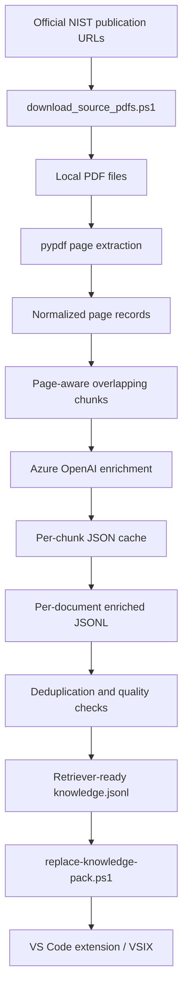

# Knowledge Manufacturing Pipeline

This folder contains the reproducible build-time pipeline that turns official NIST PDF publications into the `knowledge.jsonl` file consumed by the VS Code extension.

The pipeline is **not required by end users** who install the packaged VSIX. It is needed only when a developer wants to rebuild or replace the bundled knowledge pack.

> For the complete clean-laptop sequence—including Python installation, one-document Azure testing, the full 12-document build, extension packaging, product smoke tests, and private GitHub publication—follow [`../docs/end-to-end-guide.md`](../docs/end-to-end-guide.md).

## Tested execution order

```powershell
# From repository root
Set-ExecutionPolicy -Scope Process Bypass
cd ".\knowledge-pipeline"

py -3.12 -m venv .venv
.\.venv\Scripts\python.exe -m pip install --upgrade pip
.\.venv\Scripts\python.exe -m pip install -r requirements.txt

.\download_source_pdfs.ps1

Copy-Item ".\.env.example" ".\.env" -Force
notepad ".\.env"

.\run_01_pdf_enrichment.ps1 -Limit 1 -NoLlm
.\run_01_pdf_enrichment.ps1
.\run_02_build_knowledge.ps1

cd ..

.\scripts\replace-knowledge-pack.ps1 `
  -KnowledgeFile ".\knowledge-pipeline\out\04_knowledge_base\knowledge.jsonl"

.\scripts\test-repository.ps1
```

## Overview



## 1. Download the official PDF sources

From this folder:

```powershell
Set-ExecutionPolicy -Scope Process Bypass

.\download_source_pdfs.ps1
```

PDFs are written to:

```text
KnowledgeSource/NIST_CSF_2_0_Knowledge_Base/pdfs
```

The downloader uses only official NIST publication URLs and validates every file against a pinned SHA256 in `source_manifest.csv`.

See [`../docs/source-documents.md`](../docs/source-documents.md) for the human-readable source catalogue.

## 2. Create the Python environment

Requirements:

- Python 3.11 or newer
- Network access to the configured Azure OpenAI resource

```powershell
python -m venv .venv

.\.venv\Scripts\python.exe -m pip install --upgrade pip

.\.venv\Scripts\python.exe -m pip install -r requirements.txt
```

The runtime dependencies are deliberately small:

- `pypdf` for local PDF text extraction
- `openai` for Azure OpenAI enrichment
- `python-dotenv` for local environment configuration

## 3. Configure Azure OpenAI

```powershell
Copy-Item .env.example .env
notepad .env
```

Set:

```text
AZURE_OPENAI_ENDPOINT=https://YOUR-RESOURCE.openai.azure.com
AZURE_OPENAI_API_KEY=YOUR-KEY
AZURE_OPENAI_DEPLOYMENT=YOUR-DEPLOYMENT-NAME
AZURE_OPENAI_MODE=legacy
```

Do not commit `.env`.

## 4. Test local extraction without an LLM call

```powershell
.\run_01_pdf_enrichment.ps1 -Limit 1 -NoLlm
```

This confirms that a PDF can be opened, page text can be extracted, and chunks can be generated.

Local placeholders are intentionally excluded from the final knowledge build unless `-AllowLocalPlaceholder` is explicitly supplied.

## 5. Run extraction and Azure enrichment

```powershell
.\run_01_pdf_enrichment.ps1
```

The run is resumable. Completed chunks are cached and unchanged PDFs are skipped. Use `-Force` only when intentionally rebuilding all extraction and enrichment artifacts.

## 6. Build the retriever-ready knowledge file

```powershell
.\run_02_build_knowledge.ps1
```

Primary output:

```text
out/04_knowledge_base/knowledge.jsonl
```

Additional outputs:

```text
out/04_knowledge_base/
├── document_catalog.jsonl
├── relationships.jsonl
├── generation_quality_report.json
└── knowledge_manifest.json
```

## 7. Install the generated pack into the extension

From the repository root:

```powershell
.\scripts\replace-knowledge-pack.ps1 `
  -KnowledgeFile ".\knowledge-pipeline\out\04_knowledge_base\knowledge.jsonl"
```

Then rebuild the VSIX:

```powershell
.\scripts\build-vsix.ps1
```

## Chunking defaults

Configured in `config.json`:

```json
"chunking": {
  "target_chars": 9000,
  "overlap_chars": 1200,
  "min_chars": 500
}
```

The chunker tries to end a chunk at a paragraph, sentence, newline, or word boundary near the target size. Page markers are embedded before chunking, so each chunk retains an accurate page start and page end.

## Evidence rules

The enrichment prompt explicitly instructs the model to:

- use only the supplied PDF excerpt
- avoid outside knowledge
- avoid inventing missing details
- return structured JSON
- preserve exact source terminology where possible
- report low or partial evidence coverage

Original source text remains in every final knowledge record. Generated fields augment the evidence; they do not replace it.

## OCR limitation

`pypdf` extracts embedded text. It does not perform OCR. Image-only or scanned PDFs are reported as having no extractable text and must be OCR-processed separately before ingestion.

<!-- one-command-build:start -->
## One-command build and local installation

After the prerequisites and Azure OpenAI settings are configured, the complete workflow can be executed with one command:

```powershell
Set-ExecutionPolicy -Scope Process Bypass

.\scripts\run-all.ps1
```

The command automatically:

1. Verifies Git, Node.js, npm, Python, and the repository structure.
2. Creates or reuses the Python virtual environment.
3. Validates the Azure OpenAI `.env` configuration without printing the API key.
4. Downloads the official NIST PDFs and verifies their SHA256 hashes.
5. Extracts PDF text and creates page-aware chunks.
6. Reuses existing Azure-enriched chunks, or enriches new and changed chunks.
7. Merges the enriched documents into `knowledge.jsonl`.
8. Validates record count, source metadata, duplicate IDs, placeholders, and source-document coverage.
9. Installs the generated knowledge pack into the extension.
10. Validates the extension knowledge manifest and SHA256.
11. Reuses existing npm dependencies when they are available.
12. Runs the publication scan.
13. Compiles the TypeScript extension.
14. Packages the VSIX.
15. Installs the VSIX locally.

Expected ending:

```text
SUCCESS: complete PDF Knowledge Studio build and test passed.
```

### Required local prerequisites

Install these once:

- Visual Studio Code
- Git for Windows
- Node.js 20 or newer with npm
- Python 3.11 or newer; Python 3.12 is the tested version
- PowerShell 5.1 or newer

### Required Azure OpenAI configuration

Before the first run:

1. Create or use an Azure OpenAI resource.
2. Deploy a supported chat model.
3. Record the resource endpoint.
4. Record the deployment name.
5. Copy an API key from the resource's **Keys and Endpoint** page.
6. Create:

   ```text
   knowledge-pipeline/.env
   ```

7. Configure:

   ```text
   AZURE_OPENAI_ENDPOINT=https://YOUR-RESOURCE.openai.azure.com
   AZURE_OPENAI_API_KEY=YOUR-KEY
   AZURE_OPENAI_DEPLOYMENT=YOUR-DEPLOYMENT-NAME
   AZURE_OPENAI_MODE=legacy
   AZURE_OPENAI_API_VERSION=2024-10-21
   ```

The deployment name is the Azure deployment identifier, not necessarily the underlying model name.

Never commit `.env` or the API key.

### Common one-shot variations

Normal repeat run:

```powershell
.\scripts\run-all.ps1
```

Force all Azure enrichment again after a source, prompt, model, or chunking change:

```powershell
.\scripts\run-all.ps1 -ForceEnrichment
```

Refresh Python and npm dependencies:

```powershell
.\scripts\run-all.ps1 -RefreshDependencies
```

Build the VSIX without installing it:

```powershell
.\scripts\run-all.ps1 -SkipVsixInstall
```

The built VSIX is written to:

```text
artifacts/
```

### Scope of the command

The one-shot workflow builds, validates, packages, and optionally installs the extension locally.

It does not:

- create the Azure subscription or Azure OpenAI resource
- deploy the Azure model
- create the API key
- publish to the Visual Studio Marketplace
- publish a GitHub release

Those remain explicit administrative or release-management steps.
<!-- one-command-build:end -->
